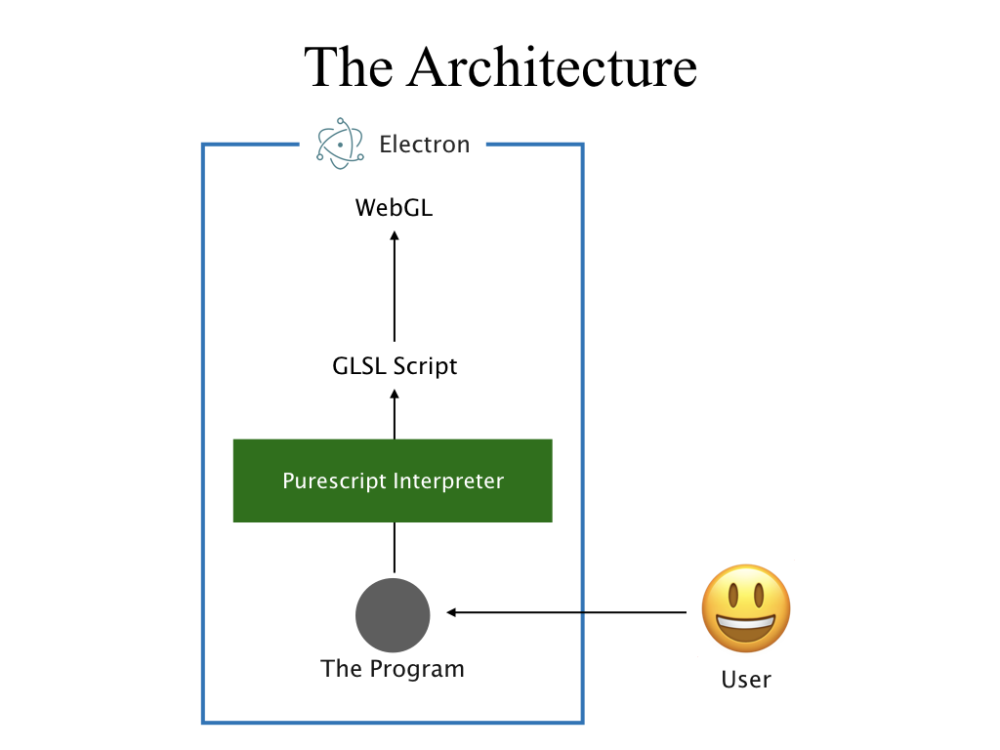

  

# Theorem Livecoding

A live coding environment for theorem proving. This software consists of two components:

- The theorems: Set of axioms and theorems.
- The visualizer: A program which generates GLSL code from the theorems.
- The application: A livecoding environment for the theorems and visualizer. It also renders output of the visualizer to the display.

The application architecture is described in the figure below.

Both the theorems and the visualizer are written in PureScript.